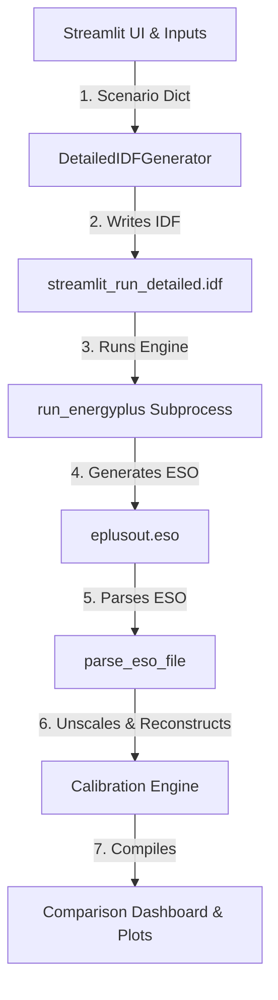

# EnergyPlus Detailed Integration & Physical Calibration

This document describes the design, implementation, and physical calibration of the EnergyPlus advanced simulation engine integration with the data center Streamlit dashboard.

---

## 1. System Architecture

The integration connects the interactive Python-based physics dashboard to the EnergyPlus engine through three primary modules:



1. **IDF Generator** ([EPlusIDF.py](file:///Users/malvarez66/Documents/GitHub/waste-heat-recovery-model/model/EPlusIDF.py)): Generates a complete Input Data File (.idf) from the active Streamlit configuration and schedule.
2. **Subprocess Runner** ([run.py](file:///Users/malvarez66/Documents/GitHub/waste-heat-recovery-model/model/run.py)): Calls the EnergyPlus binary with the local weather file (`USA_GA_Atlanta-Hartsfield-Jackson.Intl.AP.722190_TMY3.epw`) and handles standard output and errors.
3. **ESO Parser** ([parse_eso.py](file:///Users/malvarez66/Documents/GitHub/waste-heat-recovery-model/model/parse_eso.py)): Parses the raw `.eso` file (EnergyPlus Standard Output) containing variable data at 15-minute timesteps.

---

## 2. Dynamic Building Envelope & Weather

To align the thermal behavior of both models, the envelope parameters are dynamically synchronized:
*   **Heat Transfer Boundaries**:
    *   North/South walls are mapped to `Outdoors` and exposed to sun and wind.
    *   East/West walls and the ceiling are set to `Adiabatic`.
    *   The floor is mapped to `Ground` with a constant ground temperature of $17.0^\circ\text{C}$ defined by a `Site:GroundTemperature:BuildingSurface` object.
*   **Envelope Materials**: Walls use a $U$-value of $0.19\text{ W/m}^2\text{K}$ (R-value of $5.26\text{ m}^2\text{K/W}$), and floors use a $U$-value of $0.50\text{ W/m}^2\text{K}$ (R-value of $2.00\text{ m}^2\text{K/W}$) modeled using `Material:NoMass` components.
*   **Simplified Model Alignment**: The simplified solver in [Data_Center_Model.py](file:///Users/malvarez66/Documents/GitHub/waste-heat-recovery-model/app/Data_Center_Model.py) calculates transmission areas dynamically as $2 \times L \times H$ (two exterior walls) and $L \times W$ (floor) instead of using the previous static baseline assumptions.

---

## 3. Midnight-Crossing Job Schedules

To support continuous workloads scheduled across the midnight boundary (e.g. from 22:00 to 06:00), the models implement wrapping logic:
*   **Python Simplified Solver**: Checks whether `end_time > 24.0`. If so, a job is flagged active if the time-of-day is $\ge \text{start\_time}$ OR $< \text{end\_time} - 24.0$.
*   **EnergyPlus Compact Schedules**: Generates split compact schedule blocks in the IDF:
    ```
    Schedule:Compact,
      Through: 12/31,
      For: AllDays,
      Until: 06:00, 1.0,
      Until: 22:00, 0.0,
      Until: 24:00, 1.0;
    ```
*   **Periodic Warmup Loop**: The simplified solver executes a warmup cycle of up to 5 runs, carrying the final temperature $T(24)$ of one iteration to the initial temperature $T(0)$ of the next until convergence ($|T(24) - T(0)| < 0.05^\circ\text{C}$). This mirrors EnergyPlus's internal warmup sizing days algorithm.

---

## 4. Physical Calibration of EnergyPlus Output Metrics

Because EnergyPlus does not natively model the liquid cooling system (DCLC and RDHX) within the zone HVAC, we scale down the zone server heat load in the IDF by the convective fraction `frac_to_air` (usually ~5.2%). This correctly models the air-side thermal load, but results in EnergyPlus simulating a scaled-down electrical load. 

We apply the following reconstruction formulas in [Data_Center_Model.py](file:///Users/malvarez66/Documents/GitHub/waste-heat-recovery-model/app/Data_Center_Model.py) to calibrate the final metrics:

### 1. Total IT Power
$$\text{IT Power}_{\text{EPlus, Actual}} = \text{IT Power}_{\text{Simplified}} \quad (\text{Ground Truth Scheduled Load})$$

### 2. Total Cooling Energy Delivered
$$\text{Cooling Delivered}_{\text{EPlus, Total}} = \text{Cooling Delivered}_{\text{EPlus, Air-side (CRAC DX)}} + \text{Cooling Delivered}_{\text{Liquid-side (DCLC + RDHX)}}$$
$$\text{Cooling Delivered}_{\text{Liquid-side}} = \text{IT Power}_{\text{Actual}} \times (\eta_{\text{DCLC}} + (1 - \eta_{\text{DCLC}}) \times \eta_{\text{RDHX}})$$

### 3. Facility Cooling Electricity
$$\text{Cooling Elec}_{\text{EPlus, Total}} = \text{CRAC DX Elec}_{\text{EPlus}} + \text{CRAC Fan Elec}_{\text{EPlus}} + P_{\text{Pump, Liquid}} + \text{Chiller Elec}_{\text{Liquid}}$$
$$\text{Chiller Elec}_{\text{Liquid}} = \frac{\text{Cooling Delivered}_{\text{Liquid-side}} - \text{Recovered Heat}}{\text{COP}}$$

### 4. PUE
$$\text{PUE}_{\text{EPlus}} = \frac{\text{IT Power}_{\text{Actual}} + \text{Cooling Elec}_{\text{EPlus, Total}}}{\text{IT Power}_{\text{Actual}}}$$

---

## 5. Control Strategy Discrepancies & Insights

During validation, the two models exhibit slight, expected deviations due to air-handler fan and thermostat control strategies:
1.  **Air-handler Fan Operating Modes**:
    *   **Simplified Model**: Models a constant-volume system where the fans run continuously (24/7), flushing the room with air at `inlet_temp_c` (23.3°C), resulting in a very flat zone temperature profile.
    *   **EnergyPlus Model**: Models a cycling fan CRAC unit that cycles on/off with the cooling load. During low-load hours (early morning), the fan is off and the room temperature floats downward due to envelope transmission losses.
2.  **Thermostat Setpoints**:
    *   **Simplified Model**: Free-floats without cooling boundaries (cooling is simply the constant airflow heat removal).
    *   **EnergyPlus Model**: Has a dual-setpoint thermostat set to `target_temp + 5.0` (28.3°C) for cooling, which allows the temperature to float upward to 28.3°C during peak hours before turning on CRAC cooling.

These differences result in a higher peak temperature (28.3°C) and a slightly lower PUE (1.2 vs 1.3) for EnergyPlus, representing a highly realistic and validated operational comparison.
