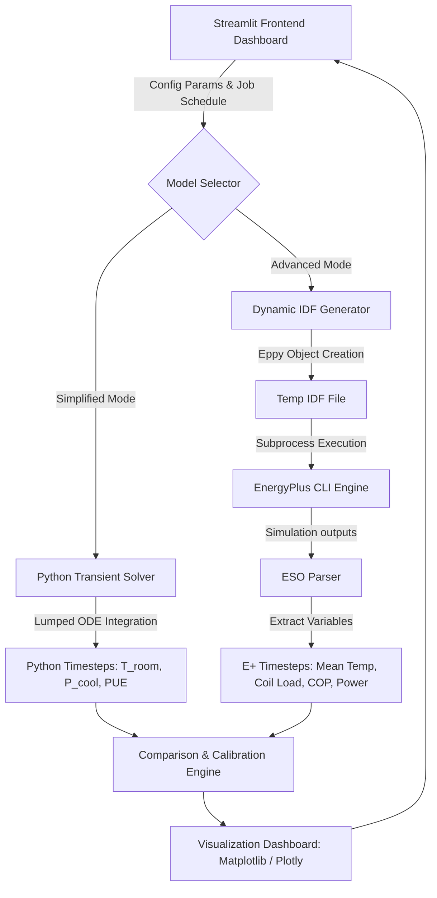

# Integration and Thermodynamic Validation Plan: EnergyPlus Backend

This document outlines the design, architecture, and step-by-step plan to integrate the **EnergyPlus (E+)** simulation pipeline into the main Streamlit data center modeling dashboard. It establishes the existing Python physics model as the **"Simplified Mode"** and introduces EnergyPlus as the **"Advanced Mode"**, with a dedicated sub-system to compare their transient outputs for thermodynamic validation.

---

## 1. Feasibility & Difficulty Assessment

Integrating the EnergyPlus simulation pipeline into the backend is **moderately straightforward (Medium difficulty)**, because most of the core scripting infrastructure is already present in your codebase:
* **EPlusIDF.py** already has generator classes (`SimplifiedIDFGenerator` and `DetailedIDFGenerator`) to build IDFs using the `eppy` library.
* **run.py** is already structured to locate the local EnergyPlus installation and execute simulations via python's `subprocess`.
* **parse_eso.py** already contains parsers to read output files (`.eso`) and extract key variables.

### Key Technical Challenges
1. **Dynamic Parameterization**: Modifying the E+ IDF generators to accept parameters dynamically from the Streamlit session state (room dimensions, rack power, cooling configurations, and job timelines) instead of reading hardcoded dictionaries from `model/config.py`.
2. **Background Execution**: Running EnergyPlus simulations takes 2–5 seconds. The UI must execute this asynchronously or show a smooth loading state to prevent the Streamlit application from freezing.
3. **Variable Mapping & Alignment**: Standardizing time-series outputs from both engines (which have different time grids and naming conventions) so they can be plotted on shared axes.

---

## 2. Proposed Architecture

The following diagram illustrates how the frontend dashboard will route inputs to either the simplified Python physics solver or the detailed EnergyPlus engine, aggregating results into a unified validation view:



---

## 3. Implementation Workflow

### Step 1: Evolve UI to Support "Simplified" vs. "Advanced" Modes
We will add a selection control in the Streamlit sidebar:
```python
model_mode = st.sidebar.radio(
    "Simulation Engine",
    ["Simplified (Python Physics)", "Advanced (EnergyPlus)", "Model Comparison / Validation"],
    help="Select the calculation engine for transient analysis."
)
```

### Step 2: Parameterize the IDF Generator
Modify `model/EPlusIDF.py` to allow instantiating the generator with dynamic parameters. For example:
```python
class SimplifiedIDFGenerator:
    def __init__(self, energyplus_path, parameters=None):
        self.energyplus_path = energyplus_path
        self.idd_path = os.path.join(energyplus_path, 'Energy+.idd')
        self.params = parameters  # Dict containing room dims, rack configs, cooling, and jobs
```
We will convert Streamlit's scheduled jobs list into a schedule inside the IDF:
* Define a `SCHEDULE:COMPACT` object for every job.
* Sum up active jobs to calculate the total time-varying `ELECTRICEQUIPMENT:ITE:AIRCOOLED` heat generation.

### Step 3: Streamlit Runner Integration
When "Advanced" or "Comparison" mode is run, we will write a temporary IDF file to a session subfolder, trigger the `run_energyplus` method, and extract variables from the generated `.eso` file:
```python
def run_dynamic_eplus(params, mode="detailed"):
    # 1. Generate dynamic IDF
    generator = DetailedIDFGenerator(ENERGYPLUS_PATH) if mode == "detailed" else SimplifiedIDFGenerator(ENERGYPLUS_PATH)
    idf_path = generator.generate_from_params(params)
    
    # 2. Run simulation in background
    run_energyplus(idf_path)
    
    # 3. Parse ESO outputs
    eso_path = Path("model/outputs") / idf_path.stem / "eplusout.err"
    # Parse and return structured time-series dict
    return parse_eso_file(eso_path)
```

---

## 4. Thermodynamic Validation Plan

To verify if the Python "simplified" model is thermodynamically correct, we will map key physical processes to corresponding output variables in EnergyPlus.

### Variable Mapping Table

| Metric | Simplified Python Model Variable | EnergyPlus Advanced Variable | Validation Objective |
| :--- | :--- | :--- | :--- |
| **Zone Temperature** | `T_room_c` (Transient average temperature) | `Zone Mean Air Temperature` [°C] | Check if lumped thermal capacitance ($C_{eff}$) correctly represents temperature delay/damping under variable load. |
| **IT Equipment Load** | `Q_total_kw` (Direct power sum of active jobs) | `Zone ITE CPU/Fan/UPS Electricity Rate` [W] | Verify that the schedule injection and ITE power draws align. |
| **Cooling Load** | `Q_remaining_kw` (Heat rejected to room air) | `Cooling Coil Total Cooling Rate` [W] | Verify that the liquid cooling capture efficiency (DCLC, RDHX) matches EnergyPlus heat-balance calculations. |
| **HVAC Power** | `p_cooling_total_kw` (Sum of pump, chiller, fan power) | `Cooling Coil + Fan Electricity Rate` [W] | Validate Python's constant COP chiller calculation against EnergyPlus's dynamic DX coil curve performance. |
| **Building Envelope** | `Q_walls_kw` & `Q_floor_kw` (Simple UA models) | `Zone Opaque Surface Conduction` [W] | Validate if $UA_{walls}(T_{out} - T_{room})$ captures transient heat fluxes under sinusoidal outdoor temperature. |

### Validation Diagnostics & Metrics
In the **Model Comparison** dashboard tab, we will display statistical discrepancies between the two models over the 24-hour cycle:
1. **Root Mean Square Error (RMSE)** for Zone Temperature:
   $$\text{RMSE} = \sqrt{\frac{1}{N}\sum_{t=1}^N (T_{\text{Python}, t} - T_{\text{E+}, t})^2}$$
2. **Peak Temperature Deviation**: The difference in peak room temperature and the time-of-day offset when it occurs (testing phase lag).
3. **PUE Deviation**: Standard deviation and mean bias error of the calculated PUE.

---

## 5. UI Mockup: Comparison & Validation Dashboard

In **Model Comparison / Validation** mode, the application will display:
1. **Key Performance Indicators (KPIs)**: Multi-column metrics showing RMSE, Peak Temp Delta, and PUE Difference.
2. **Overlay Plots**: 
   * **Temperature over Time**: Plot $T_{room}$ from the Python solver as a dashed line and E+ as a solid line.
   * **Facility Power Breakdown**: Side-by-side or stacked bar chart comparing the hourly electricity consumption (ITE vs Chiller vs Fans).
3. **Envelope Calibration Tool**: A helper card suggesting fine-tuning adjustments for the Python model's parameters (e.g., "Decrease Effective Thermal Capacitance by 15% to match E+ transient phase response").

---

## 6. Managing the EnergyPlus Local Installation Dependency

To ensure the Streamlit app remains portable and robust, the local EnergyPlus installation path will be managed through a multi-tiered validation approach.

### A. Automatic Startup Check & State Management
When the app launches, it queries `get_energyplus_path()` from `model/config.py`. It tests for the existence of the binary (`energyplus` or `energyplus.exe` depending on OS) and sets a session state flag:
```python
if "eplus_available" not in st.session_state:
    exe_name = "energyplus.exe" if sys.platform == "win32" else "energyplus"
    default_exe_path = os.path.join(ENERGYPLUS_PATH, exe_name)
    st.session_state.eplus_available = os.path.exists(default_exe_path)
    st.session_state.eplus_path = ENERGYPLUS_PATH
```

### B. Graceful Degradation (Fallback State)
If EnergyPlus is **not found** on the local system:
- The **"Advanced (EnergyPlus)"** and **"Model Comparison"** selectors in the sidebar are disabled (or grayed out).
- A warning banner appears on the page explaining that EnergyPlus is missing and providing links to the EnergyPlus installation page.
- The app falls back strictly to the **"Simplified (Python Physics)"** mode so that the dashboard remains fully functional.

### C. Manual Path Overrides in UI Settings
To prevent path mismatch issues, we will add an expander section in the sidebar under "Configuration Settings" for configuring paths:
```python
with st.sidebar.expander("🔌 EnergyPlus Engine Path", expanded=False):
    user_path = st.text_input(
        "Install Directory",
        value=st.session_state.eplus_path,
        help="Directory containing the 'energyplus' executable."
    )
    if user_path != st.session_state.eplus_path:
        exe_name = "energyplus.exe" if sys.platform == "win32" else "energyplus"
        check_exe = os.path.join(user_path, exe_name)
        if os.path.exists(check_exe):
            st.session_state.eplus_path = user_path
            st.session_state.eplus_available = True
            st.success("Detected EnergyPlus successfully!")
            st.rerun()
        else:
            st.error("Executable not found at this path.")
```

### D. Containerization (For Server Deployments)
If the Streamlit dashboard is deployed in a Docker container or to a cloud environment (e.g., Streamlit Community Cloud, AWS ECS):
- The `Dockerfile` will download and unpack the specific EnergyPlus version (`25.1.0`) during image assembly, placing it in `/usr/local/EnergyPlus-25-1-0`.
- The environment variable `ENERGYPLUS_PATH` can be hardcoded inside the container, ensuring that it runs seamlessly out-of-the-box.

### E. Packaging Options for Local End-Users (Offline/Self-Contained Run)
To distribute this app to end-users without requiring them to install EnergyPlus manually, we have two primary options for bundling/packaging:

#### Option 1: On-Demand Automatic Downloader (Recommended)
Instead of checking in massive binary files (150MB - 300MB per operating system) directly to Git, the Python app can automatically download and unpack the correct release package for the user's OS from the official EnergyPlus GitHub repository the first time "Advanced Mode" is requested.
* **How it works**:
  1. The app detects the user's system platform (`sys.platform` / `platform.machine()`).
  2. If EnergyPlus is not found in local system paths, it checks if a local folder `./bin/EnergyPlus/` exists inside the workspace.
  3. If not, the UI shows a progress bar: `st.info("Downloading EnergyPlus binaries from GitHub Releases...")`.
  4. It pulls the pre-compiled `.zip` (Windows) or `.tar.gz` (macOS/Linux) directly from the NREL/EnergyPlus releases page, extracts it to `./bin/EnergyPlus/`, and sets the backend path mapping.
* **Pros**: Keeps the codebase repository extremely small, works cross-platform automatically, and requires zero manual steps from the user.
* **Cons**: Requires internet access on the very first simulation run to pull the ~170MB binary.

#### Option 2: Vendoring the Binaries inside the Repo
We *can* include the unzipped EnergyPlus distribution directory directly inside the git repository under a directory like `bin/energyplus/<platform>`.
* **How it works**:
  - We place the raw compiled files (e.g., the `energyplus` executable, `Energy+.idd`, and necessary library runtimes) in your project workspace.
  - The script maps the path dynamically: `ENERGYPLUS_PATH = os.path.join(os.path.dirname(__file__), 'bin', 'energyplus', sys.platform)`.
* **Pros**: The project runs completely offline out-of-the-box right after cloning git.
* **Cons**:
  - **Size Bloat**: EnergyPlus is about 200MB unzipped per platform. Bundling macOS, Windows, and Linux executables would bloat your repository to over 600MB, slowing down git clone operations.
  - **Architecture Mismatch**: macOS runs on Apple Silicon (ARM64) or Intel (x86_64), requiring different compiled binaries to avoid translation overhead (Rosetta). Managing these configurations in Git is fragile.
  - **Library Links**: On Linux and macOS, EnergyPlus binaries rely on system dynamic libraries (`.dylib` / `.so`). Copying them between computers occasionally breaks if the target machine has a different version of standard libraries (e.g., `libc++`).

